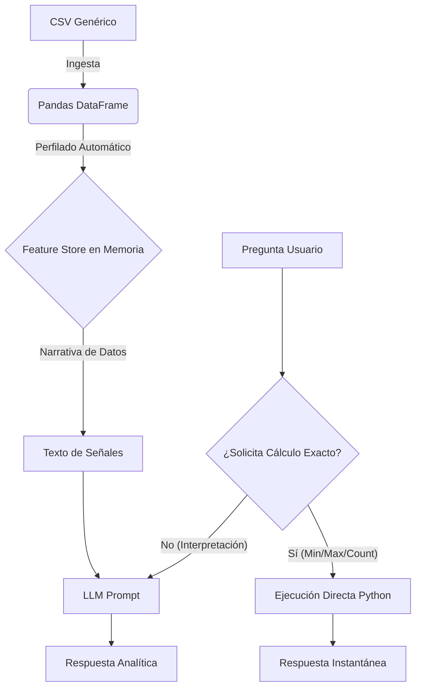

# Estrategia de Análisis Rápido de CSV: "Hybrid Feature Store" (Context-Agnostic)

Este documento describe la arquitectura y las instrucciones técnicas para implementar un sistema de análisis de datos CSV de alto rendimiento, independiente del dominio de negocio. Combina la velocidad del cálculo determinista (Python/Pandas) con la flexibilidad de la IA (LLMs).

## 1. Concepto Central: "Cálculo Primero, IA Después"
En lugar de enviar la tabla cruda a la IA para que ella "calcule" (lento, costoso y propenso a alucinaciones), el sistema debe:
1.  **Cargar** los datos en memoria (RAM).
2.  **Perfilado Automático**: Detectar tipos de columnas (Numéricas, Categóricas, Texto/Fecha).
3.  **Pre-calcular** métricas clave automáticamente (**Feature Store**).
4.  **Detectar** la intención del usuario.
5.  **Enrutamiento**:
    *   Pregunta de dato exacto (ej. "¿cuál es el máximo valor?") -> **Motor de Cálculo (Python)**.
    *   Pregunta de análisis (ej. "¿por qué bajó la métrica X?") -> **IA con Contexto Pre-digerido**.

---

## 2. Instrucciones de Implementación Genéricas

### Paso 1: Crear el "In-Memory Feature Store"
Al cargar el CSV, no solo crees un DataFrame. Genera inmediatamente un diccionario estructurado con estadísticas descriptivas ya calculadas.

**Patrón de Código (Python/Pandas):**
```python
def build_generic_feature_store(df):
    # 1. Identificar Tipos de Datos
    numeric_cols = df.select_dtypes(include=['number']).columns
    categorical_cols = df.select_dtypes(include=['object', 'category']).columns
    text_cols = [c for c in categorical_cols if df[c].str.len().mean() > 50] # Heurística para texto largo

    # 2. Agrupaciones Automáticas (Top-Level Metrics)
    # Por cada columna categórica relevante, calcular agregados de las numéricas
    groups_summary = {}
    for cat in categorical_cols:
        if df[cat].nunique() < 50: # Solo agrupar si la cardinalidad es manejable
            groups_summary[cat] = df.groupby(cat)[numeric_cols].mean().to_dict()

    # 3. Detección de Patrones en Texto (Regex Pre-computado)
    # Configurable: Lista de palabras clave de interés para el negocio (Alertas, Urgente, Error, etc.)
    flags_summary = {}
    keywords = ['error', 'fallo', 'urgente', 'crítico'] # Ejemplo configurable
    if text_cols:
        mask = df[text_cols[0]].str.contains('|'.join(keywords), case=False, na=False)
        flags_summary['matches_count'] = int(mask.sum())
        flags_summary['matches_indices'] = df[mask].index.tolist()

    return {
        'meta': {'rows': len(df), 'cols': list(df.columns)},
        'stats_global': df[numeric_cols].describe().to_dict(),
        'stats_by_group': groups_summary,
        'text_flags': flags_summary
    }
```

### Paso 2: Generar "Señales de Contexto" (Signals)
Crea una función que traduzca ese Feature Store numérico a un resumen narrativo breve. Esto alimenta al LLM.

**Instrucción:**
*   La función `build_signals(feature_store)` debe devolver un string.
*   **Contenido del string (Generado dinámicamente):**
    *   "La variable numérica 'X' tiene un promedio global de 120.5."
    *   "En la categoría 'Grupo A', la métrica 'Y' es la más alta (Valor: 500)."
    *   "Se detectaron 15 filas que contienen palabras clave de alerta en la columna 'Comentarios'."
    *   "La correlación más fuerte es entre la columna A y la columna B."
*   **Objetivo:** La IA recibe conclusiones, no datos crudos.

### Paso 3: Enrutador de Intenciones (Router)
Antes de llamar a la API del LLM, analiza el prompt del usuario con reglas simples.

**Lógica:**
*   SI el prompt contiene `["máximo", "mínimo", "mayor", "menor", "top"]`:
    *   **ACCIÓN:** Ejecuta `df.nlargest()` o `df.min()` sobre la columna inferida.
    *   **SALIDA:** Retorna el resultado exacto (JSON o Tabla) inmediatamente.
*   SI el prompt contiene `["cuántos", "cantidad", "total"]`:
    *   **ACCIÓN:** Ejecuta `df.value_counts()` o `len(df[filtro])`.
    *   **SALIDA:** Número exacto.
*   SI el prompt implica causalidad o explicación (`["por qué", "analiza", "qué opinas", "tendencia"]`):
    *   **ACCIÓN:** Construye el prompt para la IA: `Contexto: {Signals} \n Datos Clave: {Top_Rows} \n Pregunta: {User_Prompt}`.

### Paso 4: Optimización de Búsqueda de Texto
*   **Búsqueda Rápida (Determinista):** Usa `str.contains()` para filtrado inmediato por palabras clave exactas.
*   **Búsqueda Semántica (Lenta/Profunda):** Solo si el usuario hace preguntas abstractas sobre el contenido del texto (ej. "¿Qué sentimiento predomina?"), invoca un proceso de Embeddings/RAG.

---

## Resumen de la Arquitectura

